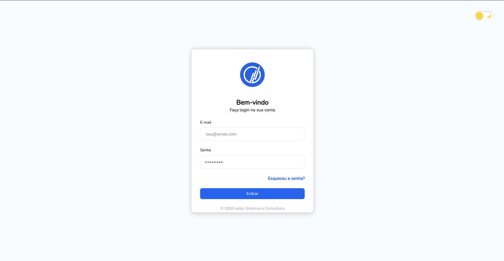
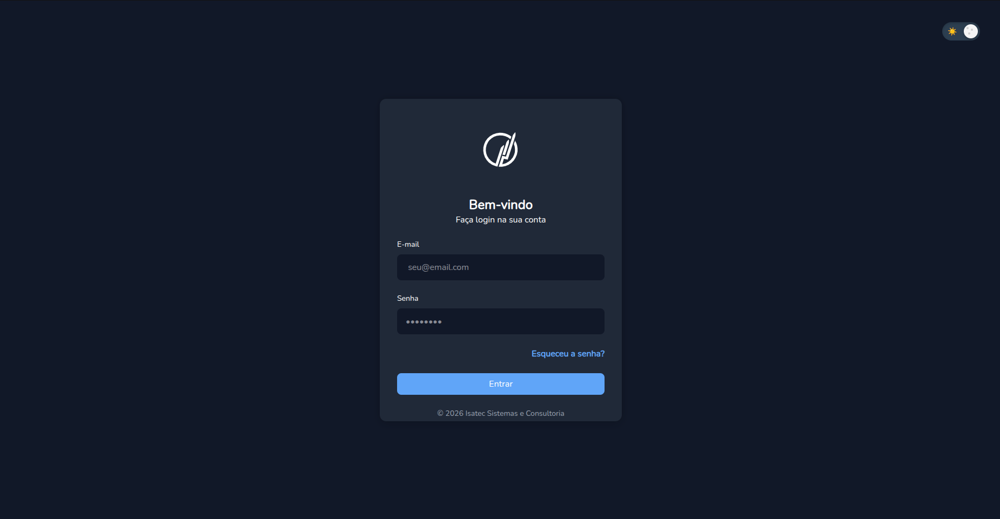

# RESULTADO FINAL

**Tema claro:**


**Tema Escuro:**


# COMO RODAR O PROJETO

## Opção normal

Para rodar o projeto (a versão do node é a 22.22.0 mas qualquer uma acima de 20 deve funcionar sem problemas)
se tiver ou nvm use o comando abaixo, se não tiver apenas instale a versão certa do node.

```bash
nvm install 22.22.0
```
### no diretório do projeto.

Para instalar as dependencias:
```bash
npm install
```

```bash
npm run dev
```
Com isso o projeto estará rodando em `http://localhost:5173/`.


## Opção Docker

### se tiver o docker na máquina rode os seguintes comandos na raiz do projeto:


```bash
docker build -t test-front .
```

```bash
docker run -d -p 8080:80 test-front
```

Com isso o projeto estará rodando em `http://localhost:8080/`.


## Opção Docker e Makefile

### se tiver o Docker e Makefile na máquina rode apenas o seguinte comando na raiz do projeto:

```bash
make do-it-all
```

Com isso o projeto estará rodando em `http://localhost:8080/`.


# ===============================================================================================================================================


# EXPLICANDO O PROJETO


### discord: rodrigo9756 ou rodrigo9756#3503
### E-mail: rodrigotmt89@gmail.com