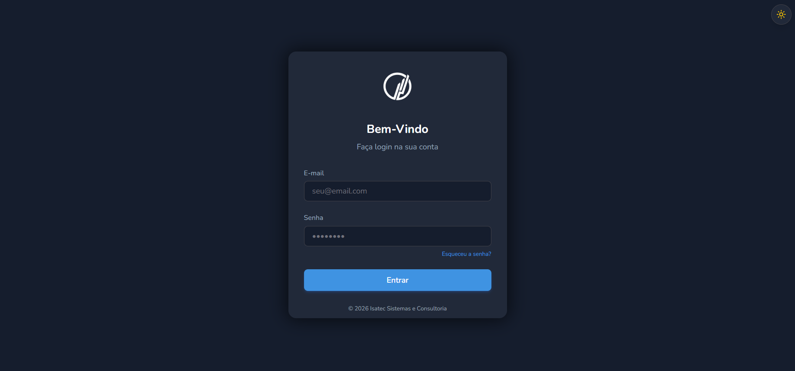

# RESULTADO

**Tema claro:**


**Tema Escuro:**


# COMO RODAR O PROJETO

## Requisitos

Node.js (versão 20 ou superior)

Para instalar as dependências:

```bash
npm install
```

```bash
npm run dev
```

Dessa forma o projeto estará rodando em `http://localhost:5173/`.

# EXPLICAÇÃO DO PROJETO

Desenvolvi o projeto utilizando Vite com React e TypeScript, busquei simplicidade mas com uma boa estruturação valorizando a experiência do usuário. Utilizei Tailwind CSS para estilização por causa da rapidez e facilidade de usar as classes utilitárias. Combinei também com variáveis CSS (design tokens) para controlar as cores e o tema.

## TEMA CLARO E ESCURO

Foi implementado usando a classe dark no HTML, variáveis CSS para cores (bg, texto, card, etc.) e um hook (useTheme) para controlar o estado. Esse hook verifica o tema no localStorage, salva a escolha do usuário e, com isso, mesmo recarregando a página, o tema escolhido continua.


# TECNOLOGIAS UTILIZADAS

React
TypeScript
Vite
Tailwind CSS
Lucide React (ícones)
CSS Variables

### Discord: .arthur1727
### E-mail: arthurvinicius082@hotmail.com
