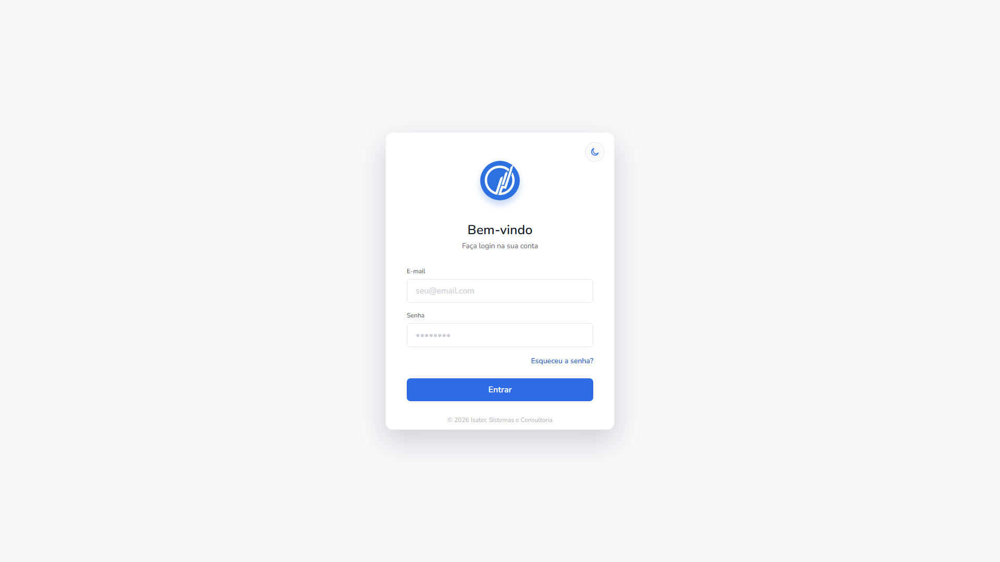
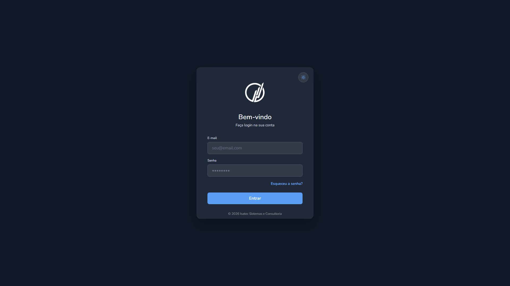
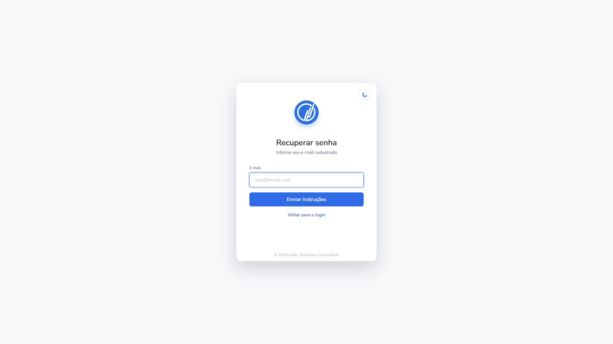
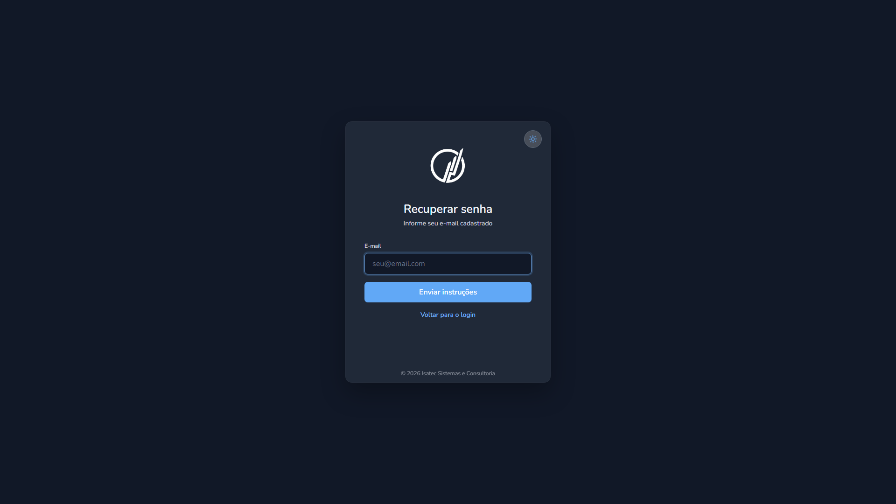
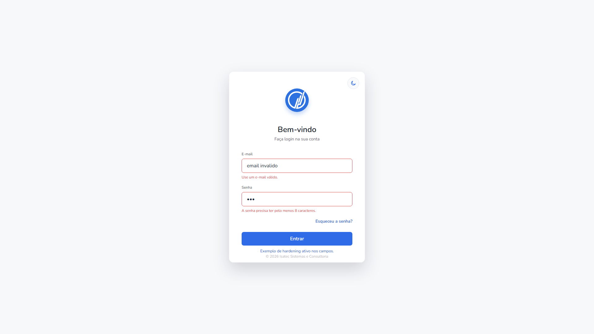

## Bem vindos!

Estamos felizes por você estar interessado(a) em integrar nosso time!

Como o número de interessados foi muito grande, vamos aplicar um pequeno teste, bem simples. Com intuito de filtrar os candidatos que só mandaram mensagem por mandar, dos realmente interessados.

## Não se preocupe

Não vamos te pedir muito, o teste consiste apenas em fazer uma tela de login. Simples né? Mas você já vai mostrar pra gente que consegue seguir um fluxo real de trabalho. Com uma demanda real, e material de apoio real.

## Como o teste vai funcionar

Você vai criar um fork desse repo, vai executar a demanda, e quando estiver pronto, vai abrir um pr. Isso vai nós indicar que você acabou e que podemos analisar o seu resultado. Simples né?

## A Demanda

Como mencionado antes você só precisa criar uma tela de login. Aqui está ela:

**Tema claro:**


**Tema Escuro:**


> Todas as imagens estão na pasta 'imagens/' para consulta.

Pode usar a tecnologia que estiver confortável para esse teste.

### Informações complementares a demanda

Tipografia:

- Nunito - font principal
- fonts secundarias não se aplicam a tela de login


## O que vai ser avaliado

- similaridade do resultado entregue com as imagens da demanda.
- performance.
- qualidade do código.
- Experiência do usuário (UX).
- Interatividade.

## Entrega

Antes de abrir o pr para sinalizar que finalizou o teste, modifique esse README.md Com seu discord para entrarmos em contato. E com uma breve explicação do seu trabalho como: tecnologias usadas, o motivo por trás do uso dessas tecnologias e etc. Explicação do projeto feita por IA vai ser desconsiderada, é necessário que você entenda o que está fazendo.

Também adicione uma sessão explicando como executar seu projeto caso ele não seja só arquivos estáticos com: instalação de dependências, build e etc.

## duvidas

Qualquer duvida pode perguntar diretamente na publicação: https://discord.com/channels/755483507698172045/1494423687233798267

## Resultado entregue

Tela de login feita com HTML, CSS e JavaScript puro, mantendo o projeto leve, sem dependencias de build e facil de revisar. A interface segue a referencia visual proposta, usa a fonte Nunito, possui tema claro e escuro, troca de tema persistida no navegador e fluxo de recuperacao de senha no mesmo card.

Discord: rdy1

### Previews

**Login - tema claro**



**Login - tema escuro**



**Recuperacao de senha - tema claro**



**Recuperacao de senha - tema escuro**



### Como executar

Por ser um projeto estatico, basta abrir o arquivo `index.html` no navegador.

Opcionalmente, para servir localmente:

```bash
python -m http.server 9011
```

Depois acesse:

- `http://127.0.0.1:9011/`
- `http://127.0.0.1:9011/?theme=light`
- `http://127.0.0.1:9011/?theme=dark`
- `http://127.0.0.1:9011/#forgot`

### Hardening dos inputs



Os campos receberam validacoes nativas e customizadas para reduzir entradas invalidas antes de qualquer integracao com backend. O e-mail e normalizado com `trim()`, conversao para minusculas, normalizacao Unicode `NFKC`, remocao de caracteres de controle, limite de 254 caracteres, `inputmode="email"`, `spellcheck="false"` e `autocapitalize="none"`.

A senha tem limite minimo e maximo, bloqueio de quebras de linha e tabs, `autocomplete="current-password"`, `spellcheck="false"` e autocorrecao desativada. Os formularios tambem usam `aria-invalid`, mensagens acessiveis por campo, honeypot invisivel e bloqueio de submit repetido durante o estado de envio.

Para ver o estado de validacao documentado no print, use `http://127.0.0.1:9011/?demo=hardening`.

